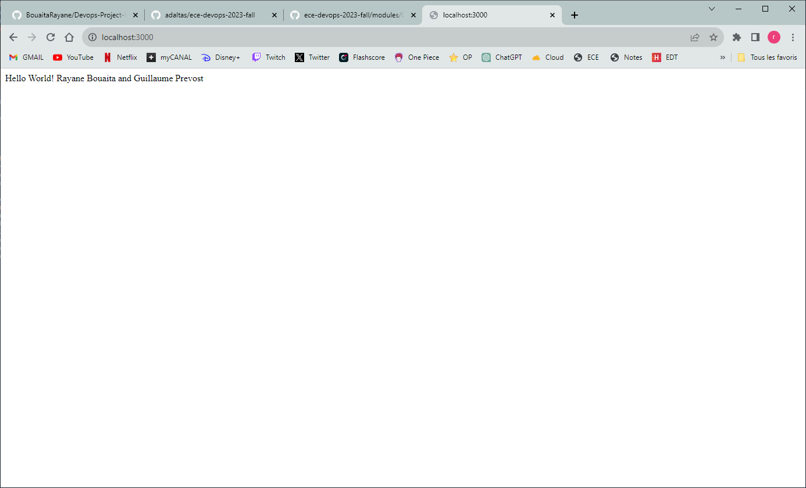
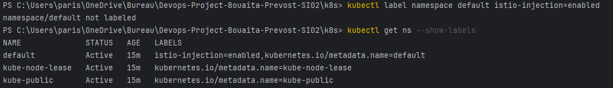
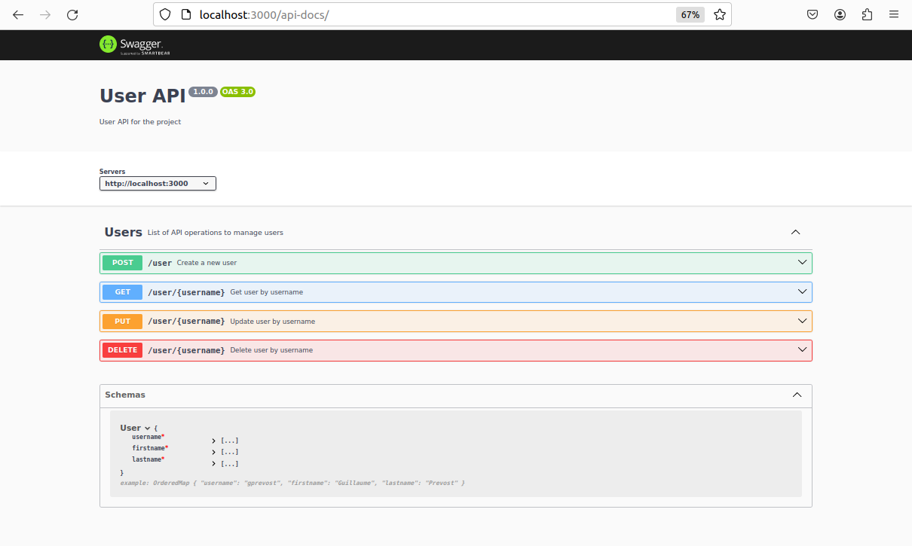
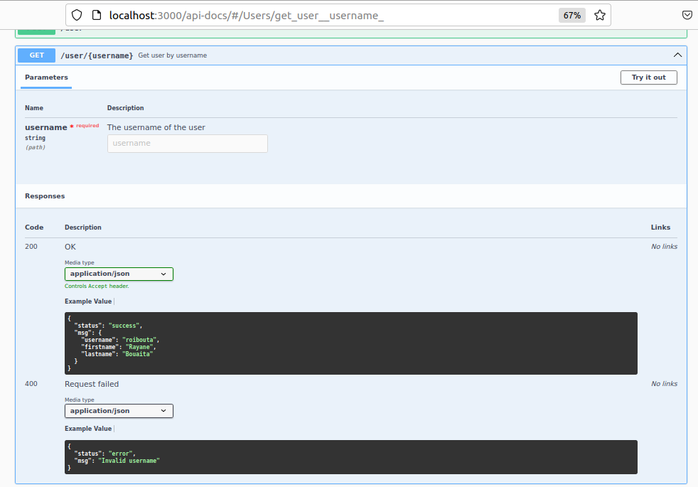
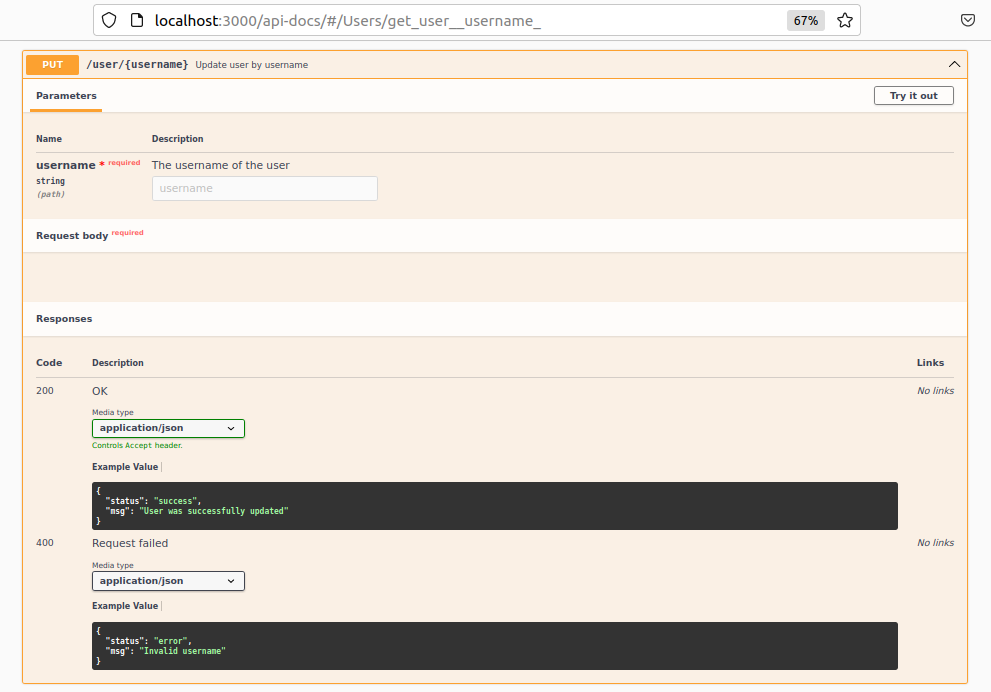
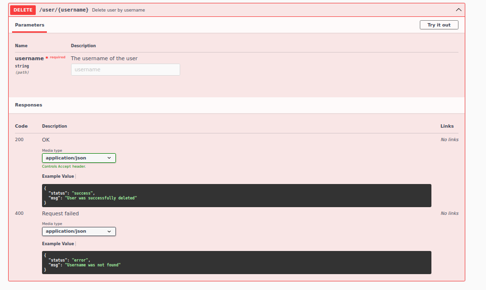

# Devops Project Rayane Bouaita and Guillaume Prevost SI02

## Authors 
* Rayane Bouaita
* Guillaume Prevost
* SI02
* 2023-2024

## Installation

This application is written on NodeJS and it uses Redis database.

1. [Install NodeJS](https://nodejs.org/en/download/)

2. [Install Redis](https://redis.io/download)

3. Install application 
4. [Install Docker](https://docs.docker.com/get-docker/)
5. [Install Vagrant](https://www.vagrantup.com/downloads)
6. [Install Ansible](https://docs.ansible.com/ansible/latest/installation_guide/intro_installation.html)
7. [Install Minikube](https://minikube.sigs.k8s.io/docs/start/)

Go to the userapi directory of the application and run:
```
npm install 
```

To start Redis perform the following command:
```bash
redis-server
```

# Tasks performed

## 1. Create a web application 

We created a web application using NodeJS and ExpressJS. The application is a simple API that allows to create, read, update and delete users. 
The application is configured to run on port 3000. The application is using Redis database to store the users. 

You can add a user using the following command:
```bash
curl -H "Content-Type: application/json" -X POST -d '{"username":"sergkudinov","firstname":"Sergei","lastname":"Kudinov"}' http://localhost:3000/user
curl -H "Content-Type: application/json" -X POST -d '{"username":"roibouta","firstname":"Rayane","lastname":"Bouaita"}' http://localhost:3000/user
```

In the application we covered the following tests:
- 2 for the configuration of the application
- 1 for redis 
- 10 for the user CRUD operations
- 8 for the user REST API

Using the following command you can run the tests:
```bash
npm test
```
Then you will see the following output:


Then to ensure healtcheck of the application we created a healthcheck endpoint that returns the status of the application. 
Also using the endpoint /user/[username] we can get the user information.


## 2. Apply CI/CD pipeline

We created a CI/CD pipeline using Github Actions. The pipeline is triggered when a push is made to the master branch.


First, we created the CI pipeline that runs the tests of the application. We use the Github Actions to run the tests.

Then, we used Azure Web Service to deploy the application. We add a job named deploy that runs when the CI pipeline is successful. This job will deploy the application on Azure Web Service.
You can access to the worlflow file [here](./.github/workflows/CICD.yml).

On the repository page, and in the actions tab, we can see the CI/CD pipeline running and the status of the pipeline:


On the azure portal, we can see the application deployed on Azure Web Service:


Then, we can access to the application using the following link: https://devops-project-bouaita-prevost-si02.azurewebsites.net/

## 3. Infrastructure as code using Vagrant and Ansible

First, we created a [Vagrantfile](./iac/Vagrantfile) that contains the configuration of the virtual machine. 
The VM is running on Ubuntu 20.04. 

Then, in the file we used the following line to use synchronization of the files between the host and the guest machine:
```bash
 config.vm.synced_folder "../", "/home/vagrant/app"
```
We provisioned the VM using Ansible. We created a [playbook](./iac/playbooks/roles/vm/install) that installs NodeJS, Redis and the application.
An another [playbook](./iac/playbooks/roles/vm/healthchecks/tasks/main.yml) to ensure the healthcheck of the application.

We use the following command to bring up the VM:
```bash
vagrant up
```
Then, to go inside the VM we use the following command:
```bash
vagrant ssh
```

We can see that redis and nodejs are installed on the VM:


We can see also the application folder that is synchronized between the host and the guest machine:


Finally, once the vrangant up or vagrant provision is done, we have the healthcheck of the application:


## 4. Build a Docker image 

We creat a [Dockerfile](./userapi/Dockerfile) that contains the configuration of the Docker image.
We use the following command to build the image:
```bash
docker build -t devops_project_bouaita_prevost .
```


Then, we push the image to the Docker Hub:
```bash
docker push rayanebouaita/devops_project_bouaita_prevost
```


In the docker hub we have: 


## 5. Docker Compose

We created a [docker-compose.yml](docker-compose.yml) file that contains the configuration of the application and the redis database.
We use the following command to run the application:
```bash
docker-compose up
```


Then, we can access to the application using the following link: http://localhost:3000/ 



We can also, check that the application is currently running by entering the following command:
```bash
docker exec -it userapi-web-1 "bash"
```


## 6. Kubernetes

First of all, we used minikube to create a local Kubernetes cluster. We used the following command to start minikube:
```bash
minikube start
```
Then we create several files on the kubernetes directory. Two files for the deployment of the application and the redis database. Two files for the services of the application and the redis database. And finally, one file for the PV and an another for the PVC.
All the files are available [here](./k8s).

Then, we used the following command to deploy the application:
```bash
kubectl apply -f pv.yaml
kubectl apply -f pvc.yaml
kubectl apply -f redis-deploy.yaml
kubectl apply -f redis-service.yaml
kubectl apply -f web-deploy.yaml
kubectl apply -f web-service.yaml
```

We can see that the application is running on the Kubernetes cluster. We can see the pods, the services and the persistent volume. We used minikube service web to access to the application.
The web application is accessible at http://127.0.0.1.56808.


## 7. Mesh using Istio

We used Istio to create a service mesh. To install Istio we can follow the [documentation](https://istio.io/latest/docs/setup/getting-started/). Once Istio is installed we move to the istio directory and we run the following command to add the istioctl client to the PATH:
```bash
export PATH=$PWD/bin:$PATH
```

Once Istio installed we configure it to our Kubernetes cluster using injection with the following command:
```bash
kubectl label namespace default istio-injection=enabled
```

To check that istio is well injected in the pods we use the following command:
```bash
kubectl get ns --show-labels
```



Then, we can create the file that will be used for route requests and traffic shifting. For the traffic shifting we choose to use the following configuration:
- 30% of the traffic goes to the v1 of the application
- 70% of the traffic goes to the v2 of the application


The files are available [here](./istio/). We use the following command on istio directry to apply the file:
```bash
kubectl apply -f .
```


## 8. Monitoring using Prometheus and Grafana

To monitor our application we used Prometheus and Grafana. We will use the samples gived by istio. Istio gives two yaml files to use Prometheus and Grafana. We use the following command to deploy them:

```bash
kubectl apply -f monitoring/prometheus.yaml
kubectl apply -f monitoring/grafana.yaml
```

In two diffrents terminals we use the following commands to port-forward Prometheus and Grafana:

```bash
kubectl port-forward svc/prometheus -n istio-system 9090
kubectl port-forward svc/grafana -n istio-system 3000
```

Then we can access to the Prometheus dashboard at http://localhost:9090 and to the Grafana dashboard at http://localhost:3000. 

Then, in the 9090 port we can see the Prometheus dashboard. We can execute queries to get metrics about our application. For example, we can get the number of requests per second on the application using the following query:
```bash
istio_requests_total
```

However, we don't have enough time to provide a dashboard with metrics about our application. We didn't manage to make working the previous command. We expected to have a dashboard with several Graph about our application.

## Bonus

### 1. Swagger-UI

In order to document our user API, we used **Swagger-UI**. We can check it at <http://localhost:3000/api-docs>.

To use it, we first need to install it with the following command:
```npm install swagger-jsdoc swagger-ui-express --save```

Then we created a file swagger.js in order to configure the differents options or settings for our API.
After that, we created the route /api-docs to check the API.

Finally we updated the user.js file to add all the descriptions we wanted to document our User API.

The default page shows the four methods we documented for the user:


Then we have the documentation for each methods with its results:
- **POST** method:


Then we have the documentation for each methods with its results:
- **GET** method:


Then we have the documentation for each methods with its results:
- **PUT** method:


Then we have the documentation for each methods with its results:
- **DELETE** method:

